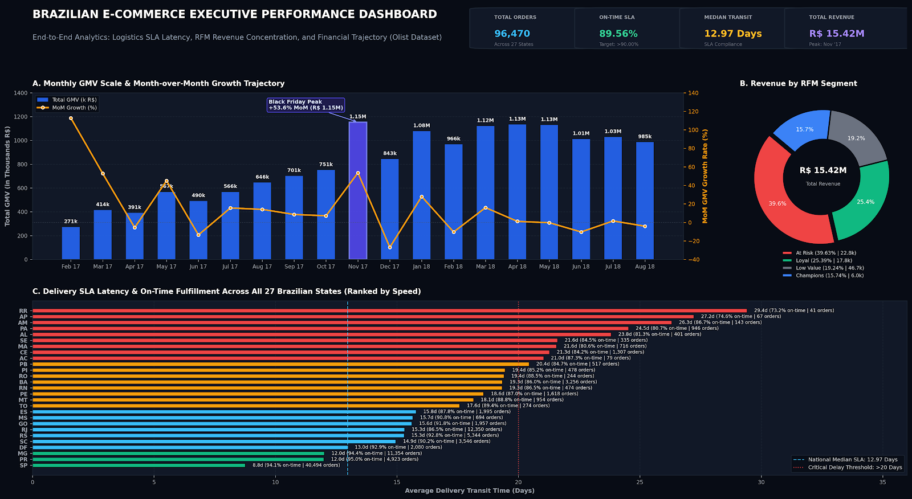

# 📦 End-to-End Brazilian E-Commerce Analytics (Olist Dataset)
> **Logistics Delivery SLA, RFM Customer Segmentation, & Financial Unit Economics**



## 📌 Project Overview & Business Problem
This project analyzes **100,000+ real e-commerce transactions** from Olist (Brazil's largest marketplace) to solve key operational and growth challenges:
1. **Logistics Bottlenecks:** Evaluating actual delivery delays against SLA estimates across different states.
2. **Revenue Concentration Risk:** Segmenting customers via RFM to identify revenue distribution and churn risks.
3. **Financial Growth & Forecasting:** Assessing Month-over-Month (MoM) GMV trajectories and running What-If order volume simulations.

---

## 🛠️ Tech Stack & Methodology
* **Data Ingestion & Cleaning:** Python (Pandas), Google Colab, KaggleHub API.
* **Data Warehousing & SQL Analytics:** SQLite3, CTEs, Window Functions (`NTILE`, `LAG`, `DENSE_RANK`), Julian Day Date Arithmetic.
* **Financial & Statistical Modeling:** Microsoft Excel (`MEDIAN`, `PERCENTILE.INC`, `STDEV.S`, Pivot Tables, Goal Seek / What-If Analysis).
* **Business Intelligence & Reporting:** Google Looker Studio (Scorecards, SLA Bar Charts, Dual-Axis MoM Time-Series Charts).

---

## 🔍 Key Business Findings

### 1. Delivery SLA Performance & Regional Inefficiencies (SQL)
* **High Volume Driver:** **São Paulo (SP)** accounts for the highest order volume (40,494 orders) with the fastest delivery time (**8.76 days**) and highest on-time delivery rate (**94.11%**).
* **Critical Bottlenecks:** Northeastern and rural states such as **Bahia (BA)** and **Rio de Janeiro (RJ)** experience the longest transit times (15–19 days) and lowest SLA compliance (**~85.9%**).

### 2. Customer Segmentation & Revenue Risk (RFM & Excel)
* **At-Risk Revenue Threat:** A total of **22,832 customers** fall under the *At Risk / Need Attention* segment, contributing **39.63% of total GMV (6.11M BRL)**. Churn in this cohort represents an immediate threat to top-line stability.
* **High-Value Threshold (P90):** The top 10% customer spending threshold is **≥ 318.08 BRL**, compared to the true median spend of **107.78 BRL**.
* **High Basket Volatility:** Standard deviation in transaction value reaches **226.31 BRL**, reflecting a wide product mix ranging from low-cost commodities to high-ticket electronics.

### 3. MoM Trajectory & Goal Seek Target Simulation
* Peak monthly sales occurred in **November 2017 (+53.57% MoM)**, reaching **1.15M BRL** driven by Black Friday campaigns.
* Based on Excel Goal Seek modeling, achieving a target GMV of **1.20M BRL** at a constant Average Order Value (AOV) of **165.94 BRL** requires scaling monthly order volume by **+1,133 orders (+18.6%)**.

---

## 💡 Strategic Business Recommendations
1. **Regional Logistics Audit:** Re-evaluate 3PL carrier contracts in RJ and BA to bring transit delays below 12 days.
2. **High-Value Win-Back Campaigns:** Deploy targeted reactivation incentives for the 22k high-spending *At-Risk* customers before permanent churn.
3. **Distributed Fulfillment Hubs:** Establish regional staging hubs closer to high-density sub-urban clusters to reduce standard deviation in delivery days.

---

## 📂 Repository Structure
```text
├── assets/                # Dashboard screenshots and architecture diagrams
│   └── dashboard_overview.png
├── data/                  # Aggregated analytical CSV extracts
│   ├── olist_delivery_metrics.csv
│   ├── olist_rfm_segments.csv
│   └── olist_monthly_growth.csv
├── notebooks/             # Python data ingestion & database creation
│   └── 01_data_ingestion_and_audit.ipynb
└── README.md
